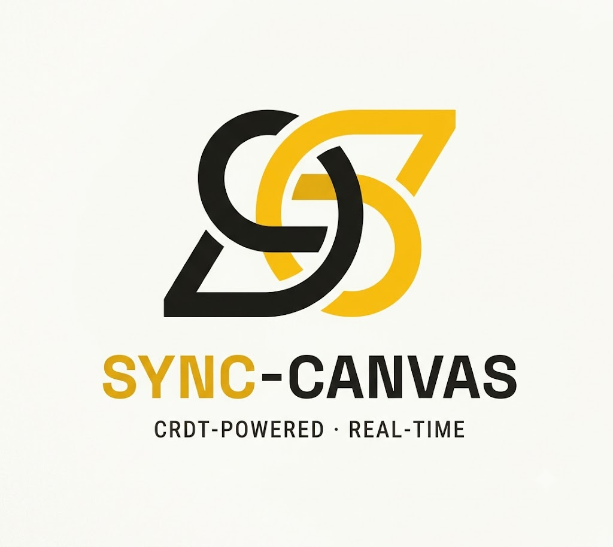

<p align="center">
  
</p>

<h1 align="center">Sync-Canvas-Editor</h1>

A conflict-free, real-time collaborative whiteboard built on **CRDTs (Yjs)**.

Create a room, share the link, and draw together. Offline edits merge cleanly when
you reconnect. Live cursors show who's drawing where. Boards are saved as history
and can be exported.

## Architecture

```
┌──────────────┐        WebSocket (Yjs sync + awareness)        ┌──────────────────┐
│  Next.js web │  ◄───────────────────────────────────────►     │  Node WS server  │
│  (Vercel)    │                                                │  (Render)        │
└──────────────┘                                                └─────────┬────────┘
                                                                          │
                                                          Redis Pub/Sub + snapshots
                                                                          │
                                                                ┌─────────▼─────────┐
                                                                │      Redis        │
                                                                │  (Render add-on)  │
                                                                └───────────────────┘
```

- **CRDT engine:** [Yjs](https://github.com/yjs/yjs) — handles offline→online merge and
  eventual consistency across distributed clients.
- **Transport:** Native Yjs sync protocol over WebSocket (`y-protocols`).
- **Scaling:** Each server instance holds the room's `Y.Doc` in memory and relays raw
  updates through Redis Pub/Sub (`room:{id}`), so any number of instances converge.
- **Persistence:** Board snapshots + metadata (public/private, permissions) live in Redis.
  Lose the ID and the board is gone — by design.

## Permissions & security model

There is **no auth** — the board ID is the access credential, and a per-browser
owner token (issued once at creation) proves ownership. Despite that, draw
permissions are **enforced server-side**, not on the honour system:

- Permission state (`drawMode` = `everyone` | `owner`, plus a set of granted user
  ids) is **server-authoritative**, stored in Redis. It is *not* kept in the CRDT
  doc, so it can't be tampered with via raw Yjs updates.
- Only the owner can change permissions — those endpoints require the owner token.
- The WebSocket layer inspects every sync message and **drops document-mutating
  messages from clients that aren't allowed to draw**. View-only clients still
  receive everything and get a live named cursor.
- Identity is passed on the WS connection: the owner token (proves ownership) and
  a self-asserted `uid` (matched against per-user grants). User ids are random and
  unguessable, which is what makes per-user grants meaningful without accounts.
- Private boards start in `owner`-only draw mode; public boards start as `everyone`.

Clients reflect permission changes by polling the permissions endpoint; the
server enforces regardless of UI state, so a stale client still can't write.

## Monorepo layout

```
apps/
  server/   Node.js WebSocket + Redis backend  → Render
  web/      Next.js frontend (Canvas)           → Vercel
```

## Local development

```bash
# 1. install
npm install

# 2. start Redis (Docker)
docker run -p 6379:6379 redis:7-alpine

# 3. backend  (http://localhost:1234)
npm run dev:server

# 4. frontend (http://localhost:3000)
npm run dev:web
```

Copy `apps/server/.env.example` → `apps/server/.env` and
`apps/web/.env.example` → `apps/web/.env.local` first.

## Integration test

With Redis and the backend running, exercise the full CRDT path (REST create →
two-client sync → awareness → persistence reload):

```bash
npm run test:e2e
```

## Deployment

Two services: the backend goes to **Render** (it needs a long-lived WebSocket
connection + Redis), the frontend to **Vercel**. Deploy the backend first so you
have its URL for the frontend's env vars.

### 1. Backend → Render

1. Render Dashboard → **New → Blueprint** → select this repo. Render reads
   [`render.yaml`](./render.yaml) from the root and provisions the web service
   **and** a Redis instance, wiring `REDIS_URL` automatically.
2. The web service uses the **Starter** plan on purpose — WebSockets need an
   instance that doesn't sleep (the free tier idles out and drops sockets).
3. After it goes live, copy the service URL, e.g. `https://sync-canvas-server.onrender.com`.

> If Render rejects `type: redis` (it now brands Redis as "Key Value"), create a
> Key Value instance manually and paste its **Internal URL** into the server's
> `REDIS_URL` env var.

### 2. Frontend → Vercel

1. Vercel → **Add New → Project** → import this repo.
2. Set **Root Directory** to `apps/web` (framework auto-detects as Next.js).
3. Add environment variables (use your Render URL; note `wss://` for the socket):

   | Variable | Value |
   |---|---|
   | `NEXT_PUBLIC_API_URL` | `https://sync-canvas-server.onrender.com` |
   | `NEXT_PUBLIC_WS_URL` | `wss://sync-canvas-server.onrender.com` |
   | `NEXT_PUBLIC_SITE_URL` | `https://<your-app>.vercel.app` |

4. Deploy, then copy the resulting Vercel URL.

### 3. Close the loop (CORS)

In Render, set the server's **`CORS_ORIGIN`** env var to your Vercel URL
(e.g. `https://sync-canvas.vercel.app`) and let it redeploy. The backend only
accepts API/WebSocket traffic from that origin.

That's it — open the Vercel URL, create a board, share the link, draw together.


